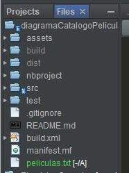

**_<h1 align="center">:vulcan_salute: Ejercicio En Clase - Catalogo de Peliculas:computer:</h1>_**
**_<h2 align="center">Módulo 2 - Fundamentos de Programación en Java</h2>_**

**_<h4>Primera parte:</h2>_**

- Catalogo de Peliculas creado según diagrama:

 
- Incluye listado, busqueda e incorporación de las películas
- Incluye Menú para reaizar consultas en colsola y almacenar datos de forma temporal
- Incluye archivo JavaDoc

**_<h4>Segunda parte:</h2>_**

- Creación de archivo .txt para almacenar datos ingresados en terminal
- Esto permite almacenar la información ingresada en Menú
- Escribo texto indicando caracteristicas del txt

- Ejecutando Main para crear archivo

- Ejecutando Main nuevamente muestra que ya esta creado el archivo

- Revisar existencia del archivo vacio peliculas.txt

- A traves del Menú se ingresan en la opción 3 diferentes peliculas

- Validando al consultar lista que se reconocen todos los datos ingresados

